# CMD Agent Select Logic - User Guide

## Overview

The **@cmd-agent-select-logic** agent is an enhanced intelligent agent selection framework that automatically routes your tasks to the optimal AI agent or orchestration system. It uses sophisticated analysis to understand your task complexity, domain requirements, and resource needs to provide the best possible agent assignment.

## Key Features

### 🧠 Intelligent Task Analysis
- **Hierarchical Classification**: Fast 2-level analysis system
- **Multi-Domain Detection**: Identifies all relevant domains in parallel
- **Confidence Scoring**: Research-based confidence calculation
- **Strategic Escalation**: Automatic routing to @agent-organizer for complex scenarios

### ⚡ Performance Optimization
- **Sub-100ms Decisions**: Fast routing for simple tasks
- **3-Layer Caching**: 80%+ cache hit ratio for common patterns
- **Circuit Breaker**: Automatic fallback for reliability
- **Performance Targets**: 50ms simple, 100ms standard, 200ms complex

## How to Use

### Automatic Invocation
The agent automatically activates when you need intelligent task routing:

```bash
# These trigger automatic agent selection
"I need help building a React component with authentication"
"Analyze this codebase for security vulnerabilities and performance issues"
"Create comprehensive documentation for our API"
```

### Explicit Invocation
For direct access to the selection framework:

```bash
@cmd-agent-select-logic "build a user dashboard with real-time updates"
@cmd-agent-select-logic "comprehensive security audit of our microservices"
```

## Decision Tree Visualization

```mermaid
graph TD
    A[Task Input] --> B{Fast Classification}
    B -->|Simple| C[Direct Agent Route]
    B -->|Standard| D[Multi-Domain Analysis]
    B -->|Complex| E[Strategic Analysis]
    
    D --> F{Confidence > 0.8?}
    F -->|Yes| C
    F -->|No| G{Domains > 3?}
    
    G -->|Yes| H[Escalate to @agent-organizer]
    G -->|No| I{Domains ≥ 2?}
    I -->|Yes| J[Orchestration Routing]
    I -->|No| C
    
    E --> K{Enterprise Scope?}
    K -->|Yes| H
    K -->|No| L{Complexity > 0.8?}
    L -->|Yes| H
    L -->|No| J
```



## Usage Scenarios

### Scenario 1: Simple Direct Tasks
**Input**: "Check the status of our deployment pipeline"

**Process**:
1. Fast classification → SIMPLE (confidence: 0.9)
2. Domain detection → Infrastructure (single domain)
3. Pattern match → Status check pattern
4. Route directly to → @monitor-system

**Expected Response**:
```markdown
🎯 Direct Agent Selected
**Confidence**: 0.92
**Decision Time**: 35ms
🚀 Executing: @monitor-system check deployment pipeline status
```

### Scenario 2: Multi-Domain Coordination
**Input**: "Build a user authentication system with React frontend and Node.js backend"

**Process**:
1. Classification → STANDARD (complexity: 0.6)
2. Domain detection → Frontend + Backend (2 domains)
3. Confidence analysis → 0.75
4. Route to → @orchestrate-agents

**Expected Response**:
```markdown
🎭 Multi-Agent Coordination
**Orchestration Type**: Standard
**Domain Count**: 2
**Confidence**: 0.75
🚀 Routing to: @orchestrate-agents "build user authentication with React and Node.js"
```

### Scenario 3: Strategic Escalation
**Input**: "Modernize our legacy monolith to microservices architecture with comprehensive security and performance optimization"

**Process**:
1. Classification → COMPLEX (complexity: 0.95)
2. Domain detection → Backend + Security + Infrastructure + Performance (4 domains)
3. Enterprise scope detected → True
4. Escalate to → @agent-organizer

**Expected Response**:
```markdown
🧠 Strategic Analysis Required
**Task Complexity**: RED (0.95)
**Domains Detected**: Backend, Security, Infrastructure, Performance
**Escalation Score**: 0.88

🎯 Routing to Strategic Analysis:
@agent-organizer [enhanced context package with full analysis]
```

## Performance Expectations

### Response Times
| Task Type | Target Time | Cache Hit | Typical Example |
|-----------|-------------|-----------|-----------------|
| Simple | <50ms | 85% | "Check log files" |
| Standard | <100ms | 70% | "Build API endpoint" |
| Complex | <200ms | 40% | "Architecture review" |

### Accuracy Metrics
- **Direct Agent Success Rate**: 92%
- **Orchestration Accuracy**: 88%
- **Escalation Appropriateness**: 94%
- **User Satisfaction Score**: 89%

## Troubleshooting

### Common Issues

#### Issue: Agent Selection Seems Wrong
**Symptoms**: Selected agent doesn't match your expectations

**Solutions**:
1. **Check Task Description**: Be more specific about your needs
   ```bash
   # Vague → Specific
   "Fix the bug" → "Debug TypeError in user authentication middleware"
   ```

2. **Verify Domain Keywords**: Include relevant domain terms
   ```bash
   # Missing context → Clear context  
   "Make it faster" → "Optimize React component rendering performance"
   ```

3. **Review Confidence Score**: Low confidence triggers escalation
   - If confidence < 0.4, task automatically escalates to @agent-organizer
   - This is often correct for ambiguous requirements

#### Issue: Slow Response Times
**Symptoms**: Decision time exceeds targets

**Solutions**:
1. **Check System Load**: High resource usage affects performance
2. **Cache Status**: Clear cache if corruption suspected
3. **Network Issues**: MCP server connectivity problems
4. **Fallback Activation**: Circuit breaker may be engaged

#### Issue: Unexpected Escalation
**Symptoms**: Simple tasks routed to @agent-organizer

**Possible Causes**:
- **Multi-Domain Detection**: Task spans multiple domains
- **Ambiguous Requirements**: Task description lacks clarity
- **Historical Failure**: Similar tasks failed previously
- **Resource Constraints**: System under load

**Resolution**:
- Add specific details to task description
- Break complex requests into smaller parts
- Check agent availability and system resources

### Debug Information

To get detailed analysis information:

```bash
# Request detailed breakdown
@cmd-agent-select-logic "analyze routing decision for: [your task]" --debug

# This provides:
# - Complexity scoring breakdown
# - Domain confidence scores  
# - Cache hit/miss status
# - Performance metrics
# - Alternative routing options
```

## Best Practices

### Task Description Guidelines

#### ✅ Good Examples
```bash
"Create a responsive React dashboard component with user authentication"
"Debug database connection timeout in Node.js API endpoints"
"Implement OAuth2 security audit with vulnerability scanning"
"Generate API documentation for our REST endpoints with examples"
```

#### ❌ Poor Examples
```bash
"Fix this"                    # Too vague
"Make the app better"         # No specific domain
"Help with coding"            # No context
"Something is broken"         # No actionable information
```

### Optimization Tips

1. **Be Specific**: Include technology names, file types, and operation details
2. **Single Focus**: Complex multi-part requests get escalated - break them down
3. **Use Keywords**: Include domain-specific terms (React, API, security, etc.)
4. **Provide Context**: Mention relevant files, components, or systems

### Integration with Other Systems

#### Works Best With:
- **@agent-organizer**: For strategic planning and complex coordination
- **@orchestrate-tasks**: For intelligent task analysis and routing
- **@orchestrate-agents**: For multi-agent coordination
- **Individual Specialists**: For direct expert consultation

#### Coordination Patterns:
```bash
# Hierarchical routing
@cmd-agent-select-logic → @agent-organizer → Multiple specialists

# Parallel coordination  
@cmd-agent-select-logic → @orchestrate-agents → Frontend + Backend agents

# Direct routing
@cmd-agent-select-logic → @security-auditor (high confidence match)
```

## Advanced Features

### Pattern Learning
The system learns from successful routing decisions:
- **Successful patterns** → Increased confidence for similar tasks
- **Failed routing** → Adjusted thresholds and alternative routes
- **User feedback** → Refined domain detection and complexity scoring

### Resource Awareness
Considers current system state:
- **Agent availability** → Routes to available alternatives
- **System load** → Adjusts complexity thresholds
- **Token budgets** → Optimizes routing for resource constraints

### Cache Intelligence
- **L1 Cache (1hr)**: Common task patterns, 85% hit rate
- **L2 Cache (30min)**: Domain analysis results
- **L3 Cache (5min)**: Complexity calculations
- **Auto-invalidation**: Updates when agent capabilities change

## Related Documentation

- **[Technical Documentation](./CMD_AGENT_SELECT_LOGIC_TECHNICAL_DOCS.md)**: Architecture and algorithms
- **[API Reference](./CMD_AGENT_SELECT_LOGIC_API_REFERENCE.md)**: Input/output formats and scoring
- **[Implementation Guide](./CMD_AGENT_SELECT_LOGIC_IMPLEMENTATION.md)**: Development and deployment
- **[Agent Organizer Guide](./AGENT_ORGANIZER_USER_GUIDE.md)**: Strategic analysis system
- **[Orchestration Guide](./ORCHESTRATION_GUIDE.md)**: Multi-agent coordination

## Support

For issues or questions:
1. Review troubleshooting section above
2. Check performance metrics and cache status  
3. Verify agent availability and system resources
4. Use debug mode for detailed analysis
5. Escalate to @agent-organizer for complex routing decisions