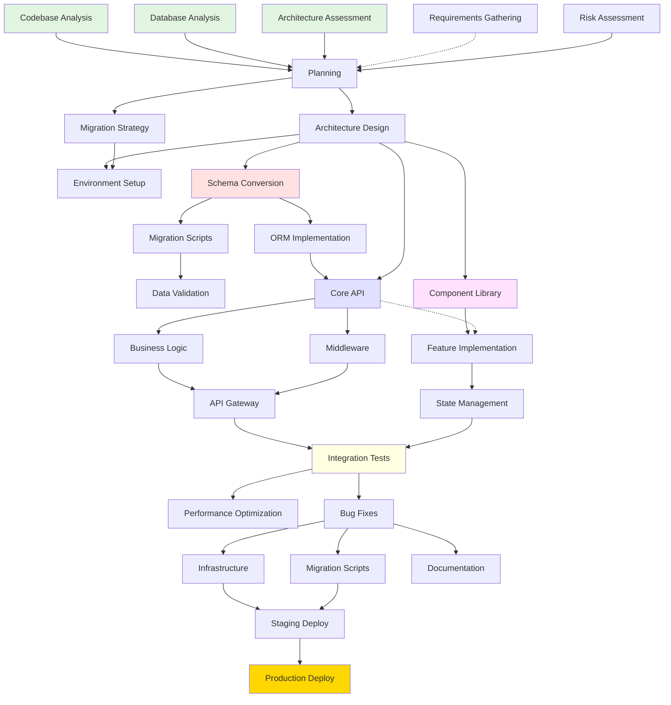

# Migration Task Dependency Tracker & Coordination Dashboard

## Task Dependency Graph



## Parallel Execution Matrix

| Phase | Task Group | Parallelizable | Dependencies | Est. Duration | Team Assignment |
|-------|------------|---------------|--------------|---------------|-----------------|
| **1.1** | Codebase Analysis | ✅ Yes | None | 3 days | Backend Team |
| **1.1** | Database Analysis | ✅ Yes | None | 2 days | Database Team |
| **1.1** | Architecture Review | ✅ Yes | None | 2 days | Architect Team |
| **1.2** | Requirements | ✅ Yes | None | 3 days | Product Team |
| **1.3** | Risk Assessment | ❌ No | 1.1, 1.2 | 1 day | All Teams |
| **2.1** | Architecture Design | ❌ No | Phase 1 | 3 days | Architect Team |
| **2.2** | Migration Strategy | ❌ No | 2.1 | 1 day | All Teams |
| **2.3** | Environment Setup | ✅ Yes | 2.1 | 2 days | DevOps Team |
| **3.1** | Schema Conversion | ❌ No | 2.2 | 2 days | Database Team |
| **3.2** | Data Migration | ❌ No | 3.1 | 3 days | Database Team |
| **3.3** | ORM Setup | ✅ Yes | 3.1 | 2 days | Backend Team |
| **4.1** | Core API | ✅ Yes | 3.3 | 5 days | Backend Teams 1-4 |
| **4.2** | Business Logic | ✅ Yes | 4.1 | 5 days | Backend Teams 1-4 |
| **4.3** | Middleware | ✅ Yes | 4.1 | 2 days | Backend Team |
| **5.1** | Components | ✅ Yes | 2.1 | 3 days | Frontend Team |
| **5.2** | Features | ✅ Yes | 4.1, 5.1 | 7 days | Frontend Teams 1-3 |
| **5.3** | State Mgmt | ❌ No | 5.1 | 2 days | Frontend Team |
| **6.1** | Integration Tests | ✅ Yes | 4.3, 5.3 | 3 days | QA Team |
| **6.2** | Performance | ✅ Yes | 6.1 | 2 days | Performance Team |
| **6.3** | Bug Fixes | ❌ No | 6.1 | 3 days | All Dev Teams |
| **7.1** | Infrastructure | ✅ Yes | 6.3 | 2 days | DevOps Team |
| **7.2** | Migration Scripts | ✅ Yes | 6.3 | 1 day | Database Team |
| **7.3** | Documentation | ✅ Yes | 6.3 | 2 days | Tech Writers |
| **8.1** | Staging Deploy | ❌ No | Phase 7 | 1 day | DevOps Team |
| **8.2** | Production | ❌ No | 8.1 | 1 day | All Teams |

## Task Coordination Commands

### Phase 1: Discovery (Fully Parallel)
```bash
# Launch all analysis tasks in parallel
@orchestrate-agents coordinate \
    --tasks "[
        'analyze-codebase:backend-analysis',
        'database-specialist:schema-analysis',
        'architect-specialist:architecture-review',
        'analyze-codebase:requirements-extraction'
    ]" \
    --mode parallel \
    --timeout 3d
```

### Phase 4: Backend Development (Team Parallel)
```bash
# Distribute services across 4 teams
@orchestrate-tasks distribute-backend \
    --services "auth,user,product,order,payment,inventory,shipping,notification" \
    --teams 4 \
    --strategy round-robin \
    --parallel true

# Team 1: auth, payment
# Team 2: user, inventory  
# Team 3: product, shipping
# Team 4: order, notification
```

### Phase 5: Frontend Features (Domain Parallel)
```bash
# Parallel feature development by domain
@orchestrate-agents frontend-features \
    --domains "[
        'auth:login,register,password-reset',
        'dashboard:overview,analytics,reports',
        'admin:users,roles,settings',
        'commerce:products,cart,checkout'
    ]" \
    --teams 3 \
    --mode parallel-by-domain
```

### Phase 6: Testing (Type Parallel)
```bash
# Run different test types in parallel
@test-automation comprehensive \
    --parallel "[
        'unit:jest:backend',
        'unit:vitest:frontend',
        'integration:supertest',
        'e2e:playwright',
        'performance:k6',
        'security:owasp-zap'
    ]" \
    --aggregate-results true
```

## Critical Path Analysis

### Minimum Time Path (Cannot be parallelized)
```
1. Risk Assessment (1d)
   ↓
2. Architecture Design (3d)
   ↓
3. Migration Strategy (1d)
   ↓
4. Schema Conversion (2d)
   ↓
5. ORM Setup (2d)
   ↓
6. Core API - Critical Service (2d)
   ↓
7. Integration Tests - Critical Path (1d)
   ↓
8. Bug Fixes (3d)
   ↓
9. Staging Deploy (1d)
   ↓
10. Production Deploy (1d)

**Minimum Duration: 17 days** (if all parallel tasks complete on time)
```

## Resource Allocation

### Team Structure
```yaml
teams:
  backend:
    count: 4
    members: 16
    focus: API, Business Logic, Services
    
  frontend:
    count: 3
    members: 12
    focus: Components, Features, UX
    
  database:
    count: 1
    members: 3
    focus: Schema, Migration, Optimization
    
  devops:
    count: 1
    members: 4
    focus: Infrastructure, CI/CD, Deployment
    
  qa:
    count: 2
    members: 6
    focus: Testing, Validation, Quality
    
  architecture:
    count: 1
    members: 2
    focus: Design, Strategy, Reviews
```

### Agent Utilization Timeline
```
Week 1-2: Analysis Phase
  Active: @analyze-codebase (100%), @database-specialist (100%), @architect-specialist (100%)
  
Week 3: Planning & Database
  Active: @architect-specialist (50%), @database-specialist (100%), @configure-environment (50%)
  
Week 4-6: Backend Development
  Active: @build-backend (100%), @python-specialist (75%), @test-automation (25%)
  
Week 5-8: Frontend Development  
  Active: @build-frontend (100%), @react-specialist (75%), @test-automation (50%)
  
Week 7-9: Integration
  Active: @test-automation (100%), @debug-issue (100%), @analyze-performance (75%)
  
Week 10-11: Deployment Prep
  Active: @deploy-application (100%), @monitor-system (75%), @generate-documentation (100%)
  
Week 12: Cutover
  Active: ALL AGENTS ON STANDBY
```

## Risk Mitigation Tracking

### High-Risk Dependencies
| Dependency | Risk Level | Mitigation Strategy | Contingency |
|------------|------------|-------------------|-------------|
| Database Migration | 🔴 High | Incremental sync, extensive testing | Rollback scripts ready |
| API Compatibility | 🟡 Medium | Version both APIs, gradual transition | Maintain PHP API |
| User Auth Migration | 🔴 High | Dual auth support period | Session bridge |
| Data Integrity | 🔴 High | Checksums, validation scripts | Backup restoration |
| Performance | 🟡 Medium | Load testing, optimization | Scale infrastructure |
| Third-party APIs | 🟡 Medium | Adapter pattern | Maintain abstractions |

## Success Metrics Dashboard

### KPI Tracking
```yaml
performance:
  target: 50% improvement
  current: [Track after Phase 6]
  
code_quality:
  target: 90% test coverage
  current: [Track during Phase 4-5]
  
migration_progress:
  target: 100% feature parity
  current: [Track throughout]
  
downtime:
  target: <2 hours
  current: [Track during Phase 8]
  
user_satisfaction:
  target: >90%
  current: [Track post-deployment]
```

## Daily Standup Checklist

### Morning Sync (9:00 AM)
- [ ] Review overnight automated tests
- [ ] Check critical path progress
- [ ] Identify blockers
- [ ] Reassign resources if needed
- [ ] Update task board

### Afternoon Check (3:00 PM)
- [ ] Verify parallel task completion
- [ ] Run integration tests
- [ ] Update dependency tracking
- [ ] Prepare next day tasks
- [ ] Communicate with stakeholders

## Automated Monitoring

```bash
# Setup continuous monitoring
@monitor-system create-dashboard \
    --metrics "task-completion,test-coverage,performance,errors" \
    --alerts "critical-path-delay,test-failure,performance-regression" \
    --notify "slack:#migration-status" \
    --update-frequency "15m"
```

## Communication Plan

### Stakeholder Updates
- **Daily**: Task completion status
- **Weekly**: Phase progress report
- **Bi-weekly**: Risk assessment update
- **Phase Completion**: Detailed review
- **Critical Issues**: Immediate escalation

### Team Coordination
- **Daily Standups**: 9:00 AM
- **Weekly Planning**: Monday 2:00 PM
- **Retrospectives**: End of each phase
- **Emergency Sync**: As needed

---

**Note**: This tracker should be updated daily during the migration. Use version control to track changes and maintain history of decisions and adjustments.