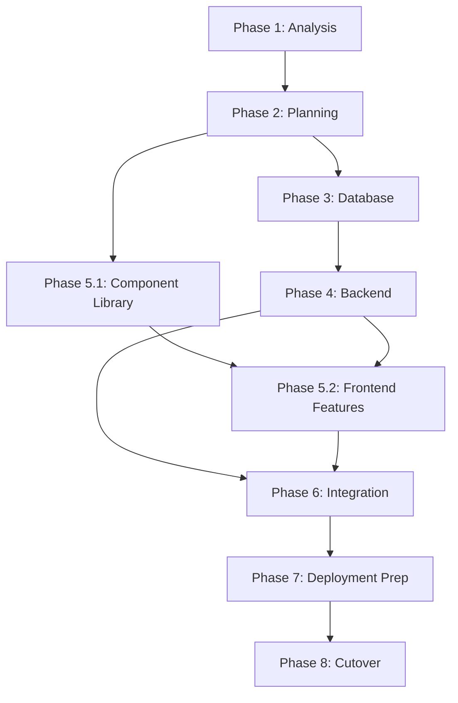

# PHP to Node.js/React Migration Strategy

## Executive Summary
Comprehensive migration plan for converting legacy PHP applications to modern Node.js/React stack with coordinated task execution, dependency mapping, and parallel processing strategies.

## Migration Architecture

### Target Stack
- **Backend**: Node.js + Express/Fastify
- **Frontend**: React 18+ with TypeScript
- **Database**: PostgreSQL/MySQL (maintain compatibility)
- **API**: RESTful + GraphQL (optional)
- **Testing**: Jest, React Testing Library, Playwright
- **Deployment**: Docker, Kubernetes, CI/CD

## Phase 1: Discovery & Analysis (Week 1-2)

### 1.1 Codebase Analysis
**Tasks**:
```bash
# Parallel execution using specialized agents
@analyze-codebase --focus backend --lang php
@database-specialist analyze-schema
@architect-specialist assess-architecture
```

**Deliverables**:
- PHP code structure report
- Database schema documentation
- Dependency mapping
- Business logic inventory
- API endpoint catalog
- Security vulnerability report

### 1.2 Requirements Gathering
**Dependencies**: None (can run parallel with 1.1)
**Tasks**:
- Document business requirements
- Identify critical features
- Map user workflows
- Define performance targets
- Establish migration constraints

### 1.3 Risk Assessment
**Dependencies**: 1.1, 1.2
**Tasks**:
- Identify high-risk components
- Data migration risks
- Downtime requirements
- Rollback strategies
- Compliance requirements

## Phase 2: Planning & Design (Week 2-3)

### 2.1 Architecture Design
**Dependencies**: Phase 1 complete
**Tasks**:
```bash
@architect-specialist design-microservices
@build-backend plan-api-structure
@build-frontend design-component-architecture
```

**Deliverables**:
- System architecture diagram
- API specification (OpenAPI)
- Component hierarchy
- Database migration plan
- Security architecture

### 2.2 Migration Strategy
**Dependencies**: 2.1
**Approach Options**:

#### Option A: Strangler Fig Pattern (Recommended)
- Gradual replacement
- Parallel running systems
- Feature-by-feature migration
- Lower risk, longer timeline

#### Option B: Big Bang Migration
- Complete rewrite
- Full cutover
- Higher risk, shorter timeline

#### Option C: Hybrid Approach
- Critical features first
- Phased cutover
- Balanced risk/timeline

### 2.3 Development Environment Setup
**Dependencies**: 2.1
**Parallel Tasks**:
```bash
# Can be executed in parallel
@configure-environment setup-nodejs
@configure-environment setup-react
@manage-database setup-dev-db
@manage-git setup-repositories
```

## Phase 3: Database Migration (Week 3-4)

### 3.1 Schema Conversion
**Dependencies**: 2.2
**Tasks**:
```bash
@database-specialist convert-schema --from mysql --to postgres
@database-specialist optimize-indexes
@database-specialist create-migration-scripts
```

### 3.2 Data Migration Strategy
**Dependencies**: 3.1
**Tasks**:
- Create ETL pipelines
- Build data validation scripts
- Implement incremental sync
- Test data integrity

### 3.3 Database Abstraction Layer
**Dependencies**: 3.1
**Tasks**:
```bash
@build-backend implement-orm --prisma
@build-backend create-models
@test-automation test-database-layer
```

## Phase 4: Backend Development (Week 4-8)

### 4.1 Core API Development
**Dependencies**: Phase 3
**Parallel Execution Strategy**:
```bash
# Divide by domain and execute in parallel
Team 1: @build-backend auth-service
Team 2: @build-backend user-service
Team 3: @build-backend product-service
Team 4: @build-backend order-service
```

### 4.2 Business Logic Migration
**Dependencies**: 4.1 per service
**Task Coordination**:
```yaml
orchestration:
  - analyzer: @analyze-codebase extract-business-rules
  - converter: @python-specialist convert-php-to-js
  - validator: @test-automation create-unit-tests
  - reviewer: @review-code validate-logic
```

### 4.3 API Gateway & Middleware
**Dependencies**: 4.1
**Tasks**:
- Implement authentication middleware
- Create rate limiting
- Add request validation
- Setup logging/monitoring

## Phase 5: Frontend Development (Week 6-10)

### 5.1 Component Library
**Dependencies**: 2.1
**Parallel Tasks**:
```bash
@build-frontend create-design-system
@build-frontend implement-core-components
@build-frontend setup-storybook
```

### 5.2 Feature Implementation
**Dependencies**: 4.1 (API ready), 5.1
**Parallel Execution**:
```yaml
feature_teams:
  auth_team:
    - @build-frontend login-component
    - @build-frontend registration-flow
    - @test-automation auth-tests
  
  dashboard_team:
    - @build-frontend dashboard-layout
    - @build-frontend analytics-widgets
    - @test-automation dashboard-tests
  
  admin_team:
    - @build-frontend admin-panel
    - @build-frontend user-management
    - @test-automation admin-tests
```

### 5.3 State Management
**Dependencies**: 5.1
**Tasks**:
- Implement Redux/Zustand
- Create data fetching layer
- Setup caching strategy
- Implement real-time updates

## Phase 6: Integration & Testing (Week 8-11)

### 6.1 Integration Testing
**Dependencies**: Phase 4, Phase 5
**Parallel Testing Strategy**:
```bash
@test-automation integration-tests --parallel
@test-automation e2e-tests --playwright
@analyze-performance load-testing
@secure-application security-testing
```

### 6.2 Performance Optimization
**Dependencies**: 6.1
**Tasks**:
```bash
@analyze-performance backend-optimization
@analyze-performance frontend-optimization
@build-frontend implement-code-splitting
@build-backend implement-caching
```

### 6.3 Bug Fixing & Refinement
**Dependencies**: 6.1
**Iterative Process**:
```bash
while issues_exist:
  @debug-issue investigate
  @build-backend fix-backend-issues
  @build-frontend fix-frontend-issues
  @test-automation regression-tests
```

## Phase 7: Deployment Preparation (Week 11-12)

### 7.1 Infrastructure Setup
**Dependencies**: Phase 6
**Parallel Tasks**:
```bash
@deploy-application setup-docker
@deploy-application configure-kubernetes
@configure-environment setup-ci-cd
@monitor-system setup-monitoring
```

### 7.2 Migration Scripts
**Dependencies**: 7.1
**Tasks**:
- Create data migration scripts
- Build rollback procedures
- Implement blue-green deployment
- Setup feature flags

### 7.3 Documentation
**Dependencies**: All phases
**Parallel Documentation**:
```bash
@generate-documentation api-docs
@generate-documentation user-guides
@generate-documentation deployment-guides
@generate-documentation troubleshooting
```

## Phase 8: Deployment & Cutover (Week 12-13)

### 8.1 Staging Deployment
**Dependencies**: Phase 7
**Tasks**:
```bash
@deploy-application deploy-staging
@test-automation smoke-tests
@monitor-system validate-metrics
```

### 8.2 Production Migration
**Dependencies**: 8.1
**Execution Strategy**:
```yaml
cutover_strategy:
  1_preparation:
    - Database backup
    - Traffic routing setup
    - Rollback preparation
  
  2_migration:
    - Deploy new system
    - Migrate data
    - Switch DNS/Load balancer
  
  3_validation:
    - Health checks
    - Smoke tests
    - Performance monitoring
  
  4_stabilization:
    - Monitor for 24-48 hours
    - Fix critical issues
    - Optimize as needed
```

## Execution Coordination

### Task Orchestration Model
```yaml
coordination:
  type: hierarchical_with_parallel
  
  orchestrator: @orchestrate-agents
  
  teams:
    backend_team:
      lead: @build-backend
      support: [@database-specialist, @python-specialist]
      
    frontend_team:
      lead: @build-frontend
      support: [@react-specialist, @build-frontend]
      
    quality_team:
      lead: @test-automation
      support: [@review-code, @debug-issue]
      
    infrastructure_team:
      lead: @deploy-application
      support: [@configure-environment, @monitor-system]
```

### Dependency Graph


### Parallel Execution Opportunities
1. **Phase 1**: All analysis tasks can run in parallel
2. **Phase 3-5**: Database, Backend core, Frontend components can overlap
3. **Phase 4**: Service development can be parallelized by domain
4. **Phase 5**: Feature teams work independently
5. **Phase 6**: Different test types run in parallel
6. **Phase 7**: Infrastructure and documentation in parallel

## Risk Mitigation

### Critical Risk Areas
1. **Data Loss**: Implement comprehensive backup strategy
2. **Downtime**: Use blue-green deployment
3. **Performance Degradation**: Continuous performance testing
4. **Security Vulnerabilities**: Regular security audits
5. **Feature Parity**: Detailed requirement tracking

### Rollback Strategy
```yaml
rollback_levels:
  level_1_feature:
    - Feature flags
    - Instant toggle
    - No downtime
    
  level_2_service:
    - Service-level rollback
    - <5 minute downtime
    - Database compatible
    
  level_3_complete:
    - Full system rollback
    - 30-60 minute downtime
    - Database restoration
```

## Success Metrics

### KPIs
- **Performance**: 50% improvement in response times
- **Scalability**: Support 10x current load
- **Maintainability**: 70% reduction in bug fix time
- **Developer Velocity**: 2x feature delivery speed
- **User Satisfaction**: >90% satisfaction score

### Monitoring Strategy
```bash
@monitor-system setup-apm        # Application Performance
@monitor-system setup-logging    # Centralized logging
@monitor-system setup-alerting   # Proactive alerts
@monitor-system setup-dashboards # Real-time visibility
```

## Timeline Summary

| Phase | Duration | Dependencies | Parallel Potential |
|-------|----------|--------------|-------------------|
| 1. Analysis | 2 weeks | None | High |
| 2. Planning | 1 week | Phase 1 | Medium |
| 3. Database | 1 week | Phase 2 | Low |
| 4. Backend | 4 weeks | Phase 3 | High |
| 5. Frontend | 4 weeks | Partial Phase 4 | High |
| 6. Integration | 3 weeks | Phase 4+5 | High |
| 7. Deployment Prep | 1 week | Phase 6 | High |
| 8. Cutover | 1 week | Phase 7 | Low |

**Total Timeline**: 12-13 weeks with parallel execution

## Command Execution Examples

### Starting the Migration
```bash
# Phase 1: Parallel analysis
@orchestrate-agents coordinate \
  --tasks "analyze-codebase,database-specialist,architect-specialist" \
  --mode parallel \
  --output analysis-report

# Phase 4: Backend development with team coordination
@orchestrate-tasks backend-migration \
  --teams 4 \
  --services "auth,user,product,order" \
  --parallel true

# Phase 6: Comprehensive testing
@test-automation full-suite \
  --integration \
  --e2e \
  --performance \
  --security \
  --parallel 4
```

## Post-Migration

### Optimization Phase (Ongoing)
- Performance tuning
- Feature enhancements
- Technical debt reduction
- Team training
- Documentation updates

### Maintenance Strategy
- Regular dependency updates
- Security patches
- Performance monitoring
- Capacity planning
- Disaster recovery testing

---

**Note**: This migration plan is designed for maximum parallelization while maintaining quality and minimizing risk. Adjust timelines based on team size and application complexity.