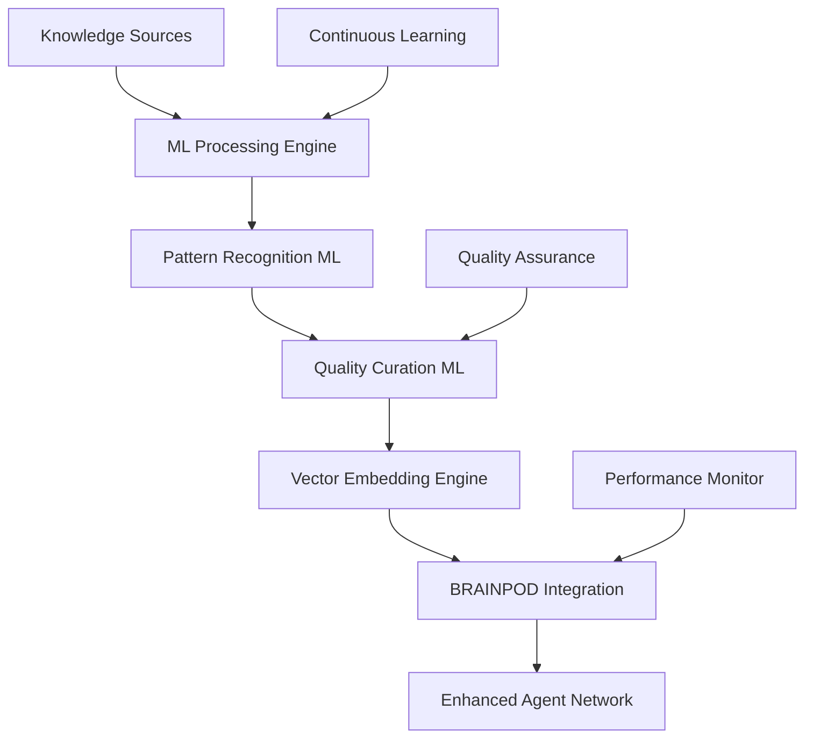

# ML-Driven Knowledge Extraction & Enhancement Pipeline
*Scaling Enhanced Agent Portfolio to 20+ Agents*

## 🎯 Executive Summary

**Mission**: Scale from 2 enhanced agents to 20+ using ML-driven knowledge extraction, targeting $10M+ annual value creation with enterprise-grade performance.

**Success Metrics**:
- **Scale**: 20+ enhanced agents over 6 months
- **Knowledge Volume**: 16,000-24,000 patterns (800-1,200 per agent)
- **Performance**: <500ms response times maintained
- **Quality**: 90-95% source credibility, >95% pattern accuracy
- **Business Impact**: $10M+ annual value projection

## 🏗️ Pipeline Architecture Overview



### Core Components

1. **Knowledge Harvesting Engine** - Multi-source data acquisition with ML-driven filtering
2. **Pattern Recognition System** - Deep learning models for code/architecture pattern extraction
3. **Quality Curation Pipeline** - ML-based quality assessment and validation
4. **Vector Intelligence Layer** - Optimized embedding generation and storage
5. **BRAINPOD Orchestration** - Seamless integration with existing infrastructure
6. **Continuous Learning Framework** - Adaptive improvement and knowledge currency

## 📊 System Architecture & Implementation

### 1. Knowledge Source Processing Engine

#### Primary Data Sources
```yaml
web_content_sources:
  - official_documentation: 40% (React, Python, Security frameworks)
  - authoritative_blogs: 25% (Key thought leaders, industry experts)
  - community_platforms: 20% (Stack Overflow, Reddit technical communities)
  - research_papers: 15% (ArXiv, industry research, white papers)

repository_sources:
  - high_quality_repos: GitHub trending, enterprise patterns, popular libraries
  - filtering_criteria: >1000 stars, active maintenance, comprehensive documentation
  - pattern_extraction: Code patterns, architectural decisions, best practices
  
documentation_sources:
  - framework_docs: Official API documentation, guides, tutorials
  - specification_docs: Standards, RFCs, protocol documentation
  - enterprise_guides: Cloud provider docs, enterprise architecture patterns
```

#### ML-Enhanced Source Processing
```python
class KnowledgeHarvestingEngine:
    def __init__(self):
        self.firecrawl_client = FirecrawlClient()
        self.github_miner = GitHubPatternMiner()
        self.doc_processor = DocumentationProcessor()
        self.ml_filter = ContentQualityClassifier()
    
    async def harvest_knowledge_sources(self, domain_spec):
        """ML-driven multi-source knowledge harvesting"""
        
        # 1. Source Discovery & Ranking
        sources = await self.discover_authoritative_sources(domain_spec)
        ranked_sources = self.ml_filter.rank_source_credibility(sources)
        
        # 2. Parallel Content Extraction
        content_batches = await asyncio.gather(*[
            self.firecrawl_client.extract_structured_content(source)
            for source in ranked_sources[:50]  # Top 50 sources per domain
        ])
        
        # 3. ML-Based Content Filtering
        quality_content = self.ml_filter.filter_high_quality_content(
            content_batches,
            min_credibility=85,
            relevance_threshold=0.8
        )
        
        return quality_content
    
    def discover_authoritative_sources(self, domain):
        """ML-powered source discovery with credibility scoring"""
        return {
            'documentation': self.find_official_docs(domain),
            'repositories': self.github_miner.find_exemplary_repos(domain),
            'community': self.discover_expert_content(domain),
            'research': self.find_research_papers(domain)
        }
```

### 2. Pattern Recognition & Extraction System

#### Deep Learning Models for Pattern Recognition

```python
class PatternRecognitionSystem:
    def __init__(self):
        self.code_pattern_model = CodeBERT()  # Microsoft CodeBERT for code understanding
        self.architecture_model = GraphSAGE()  # For architectural pattern detection
        self.semantic_model = SentenceTransformers('all-mpnet-base-v2')
        self.quality_classifier = BERTQualityClassifier()
    
    async def extract_patterns(self, content_batch):
        """Multi-model pattern extraction pipeline"""
        
        # 1. Code Pattern Detection
        code_patterns = await self.extract_code_patterns(content_batch)
        
        # 2. Architecture Pattern Mining
        arch_patterns = await self.extract_architecture_patterns(content_batch)
        
        # 3. Best Practice Identification
        best_practices = await self.extract_best_practices(content_batch)
        
        # 4. Anti-pattern Detection
        anti_patterns = await self.detect_anti_patterns(content_batch)
        
        return {
            'code_patterns': code_patterns,
            'architecture_patterns': arch_patterns,
            'best_practices': best_practices,
            'anti_patterns': anti_patterns
        }
    
    async def extract_code_patterns(self, content):
        """CodeBERT-powered code pattern extraction"""
        
        # Parse code blocks and functions
        code_blocks = self.parse_code_blocks(content)
        
        # Generate embeddings and cluster similar patterns
        embeddings = self.code_pattern_model.encode(code_blocks)
        clusters = self.cluster_patterns(embeddings, min_cluster_size=5)
        
        # Extract representative patterns from each cluster
        patterns = []
        for cluster in clusters:
            pattern = self.extract_pattern_template(cluster)
            quality_score = self.quality_classifier.score_pattern(pattern)
            
            if quality_score > 0.8:
                patterns.append({
                    'pattern': pattern,
                    'usage_frequency': len(cluster),
                    'quality_score': quality_score,
                    'embedding': np.mean([embeddings[i] for i in cluster], axis=0)
                })
        
        return patterns
```

#### Model Selection Criteria

| Model Type | Primary Model | Backup Model | Use Case |
|------------|---------------|--------------|----------|
| **Code Understanding** | Microsoft CodeBERT | CodeT5 | Code pattern extraction, semantic analysis |
| **Architecture Analysis** | GraphSAGE | GCN | System design pattern detection |
| **Text Processing** | all-mpnet-base-v2 | all-MiniLM-L12-v2 | Documentation, best practices |
| **Quality Assessment** | Custom BERT Classifier | DistilBERT | Content quality, credibility scoring |
| **Similarity Matching** | Sentence-BERT | Universal Sentence Encoder | Pattern clustering, deduplication |

### 3. Quality Curation & Validation Pipeline

#### ML-Driven Quality Assessment
```python
class QualityCurationPipeline:
    def __init__(self):
        self.credibility_scorer = SourceCredibilityModel()
        self.semantic_deduplicator = SemanticDeduplication()
        self.coherence_validator = CoherenceValidator()
        self.completeness_analyzer = CompletenessAnalyzer()
    
    async def curate_knowledge_batch(self, extracted_patterns):
        """Comprehensive ML-driven quality curation"""
        
        # 1. Semantic Clustering & Deduplication
        deduplicated = await self.semantic_deduplicator.process(
            extracted_patterns,
            similarity_threshold=0.85
        )
        
        # 2. Authority & Credibility Validation
        validated = await self.credibility_scorer.validate_batch(
            deduplicated,
            min_credibility=85,
            max_recency_days=365
        )
        
        # 3. Coherence & Consistency Testing
        coherent = await self.coherence_validator.validate_coherence(
            validated,
            cross_reference_threshold=0.9
        )
        
        # 4. Completeness Analysis & Gap Detection
        complete = await self.completeness_analyzer.fill_gaps(
            coherent,
            coverage_threshold=0.85
        )
        
        return {
            'curated_patterns': complete,
            'quality_metrics': self.generate_quality_report(complete),
            'improvement_suggestions': self.identify_gaps(complete)
        }
    
    def generate_quality_report(self, patterns):
        """Comprehensive quality metrics generation"""
        return {
            'total_patterns': len(patterns),
            'avg_credibility': np.mean([p['credibility'] for p in patterns]),
            'coverage_score': self.calculate_domain_coverage(patterns),
            'freshness_score': self.calculate_freshness(patterns),
            'coherence_score': self.calculate_coherence(patterns)
        }
```

#### Quality Scoring Matrix
```yaml
credibility_factors:
  source_authority: 35%      # Official docs, recognized experts
  peer_validation: 25%       # Community consensus, citations
  empirical_evidence: 20%    # Performance data, case studies
  recency: 10%              # Knowledge currency
  consistency: 10%          # Cross-source validation

quality_thresholds:
  minimum_credibility: 85/100
  pattern_accuracy: 95%
  coverage_completeness: 85%
  coherence_score: 90%
```

### 4. Vector Embedding & Optimization Engine

#### High-Performance Embedding Strategy
```python
class VectorIntelligenceLayer:
    def __init__(self):
        self.embedding_model = SentenceTransformers('all-mpnet-base-v2')
        self.compression_engine = PCACompressionEngine()
        self.quantization_engine = ProductQuantization()
        self.qdrant_optimizer = QdrantOptimizer()
    
    async def generate_optimized_embeddings(self, curated_patterns):
        """High-performance embedding generation with optimization"""
        
        # 1. Generate High-Quality Embeddings
        raw_embeddings = []
        for pattern_batch in self.batch_patterns(curated_patterns, batch_size=32):
            batch_embeddings = self.embedding_model.encode(
                pattern_batch,
                normalize_embeddings=True,
                show_progress_bar=True
            )
            raw_embeddings.extend(batch_embeddings)
        
        # 2. Dimensionality Optimization
        optimized_embeddings = self.compression_engine.compress(
            raw_embeddings,
            target_dimensions=384,  # Optimized for Qdrant performance
            variance_retention=0.95
        )
        
        # 3. Quantization for Storage Efficiency
        quantized_embeddings = self.quantization_engine.quantize(
            optimized_embeddings,
            compression_ratio=0.5,
            accuracy_retention=0.98
        )
        
        return {
            'embeddings': quantized_embeddings,
            'metadata': self.generate_embedding_metadata(curated_patterns),
            'performance_metrics': self.calculate_performance_metrics(quantized_embeddings)
        }
    
    def optimize_for_qdrant(self, embeddings_batch):
        """Qdrant-specific optimization for sub-500ms queries"""
        return {
            'collection_config': {
                'vectors_config': {
                    'size': 384,
                    'distance': 'Cosine',
                    'hnsw_config': {
                        'ef_construct': 200,
                        'full_scan_threshold': 10000,
                        'm': 16
                    }
                },
                'optimizers_config': {
                    'default_segment_number': 2,
                    'max_segment_size': 200000,
                    'memmap_threshold': 50000
                }
            },
            'indexing_strategy': 'hierarchical',
            'caching_policy': 'aggressive'
        }
```

#### Performance Optimization Specifications
```yaml
embedding_optimization:
  model_selection: all-mpnet-base-v2  # Best accuracy/speed balance
  dimension_target: 384               # Optimal for Qdrant performance
  compression_ratio: 0.5             # 50% storage reduction
  accuracy_retention: 98%            # Maintain high retrieval quality

qdrant_optimization:
  hnsw_ef_construct: 200             # Index quality vs build time
  segment_optimization: 2            # Optimal for query performance
  memory_mapping: 50000              # Balance memory vs disk
  cache_strategy: aggressive         # Sub-500ms query targets

performance_targets:
  embedding_generation: <100ms       # Per pattern
  index_update: <1s                  # Per batch (100 patterns)
  query_response: <200ms             # Single pattern retrieval
  batch_query: <500ms                # Multi-pattern queries
```

### 5. BRAINPOD Integration & Orchestration

#### Seamless Infrastructure Integration
```python
class BRAINPODOrchestrator:
    def __init__(self):
        self.qdrant_client = QdrantClient()
        self.chroma_client = ChromaClient()
        self.redis_client = RedisClient()
        self.performance_monitor = PerformanceMonitor()
    
    async def integrate_enhanced_knowledge(self, agent_spec, knowledge_batch):
        """Seamless integration with existing BRAINPOD infrastructure"""
        
        # 1. Qdrant Collection Setup
        collection_name = f"{agent_spec['domain']}_patterns_comprehensive"
        await self.setup_optimized_collection(collection_name, knowledge_batch)
        
        # 2. Chroma Session Tracking
        session_data = {
            'agent_id': agent_spec['name'],
            'knowledge_version': knowledge_batch['version'],
            'pattern_count': len(knowledge_batch['patterns']),
            'quality_metrics': knowledge_batch['quality_metrics']
        }
        await self.chroma_client.log_session(session_data)
        
        # 3. Redis Performance Caching
        cache_keys = self.generate_cache_strategy(agent_spec)
        await self.redis_client.setup_agent_cache(
            agent_spec['name'],
            cache_keys,
            ttl=3600  # 1 hour cache for frequent patterns
        )
        
        # 4. Performance Validation
        performance_metrics = await self.validate_integration_performance(
            collection_name,
            target_response_time=500  # ms
        )
        
        return {
            'integration_status': 'success',
            'collection_name': collection_name,
            'performance_metrics': performance_metrics,
            'cache_configuration': cache_keys
        }
    
    async def setup_optimized_collection(self, collection_name, knowledge_batch):
        """Optimized Qdrant collection setup for enterprise performance"""
        
        # Collection configuration optimized for <500ms queries
        collection_config = {
            'vectors_config': {
                'size': 384,
                'distance': 'Cosine',
                'hnsw_config': {
                    'ef_construct': 200,
                    'full_scan_threshold': 10000,
                    'm': 16
                }
            },
            'optimizers_config': {
                'default_segment_number': 2,
                'max_segment_size': 200000,
                'memmap_threshold': 50000
            }
        }
        
        # Create collection with optimization
        await self.qdrant_client.create_collection(
            collection_name=collection_name,
            vectors_config=collection_config['vectors_config'],
            optimizers_config=collection_config['optimizers_config']
        )
        
        # Batch upsert with performance monitoring
        batch_size = 100
        for i in range(0, len(knowledge_batch['patterns']), batch_size):
            batch = knowledge_batch['patterns'][i:i+batch_size]
            
            start_time = time.time()
            await self.qdrant_client.upsert(
                collection_name=collection_name,
                points=self.format_qdrant_points(batch)
            )
            
            upsert_time = time.time() - start_time
            self.performance_monitor.record_upsert_performance(
                collection_name, len(batch), upsert_time
            )
```

### 6. Continuous Learning & Adaptation Framework

#### Feedback-Driven Improvement System
```python
class ContinuousLearningFramework:
    def __init__(self):
        self.feedback_processor = FeedbackProcessor()
        self.pattern_analyzer = PatternUsageAnalyzer()
        self.knowledge_updater = KnowledgeUpdater()
        self.performance_optimizer = PerformanceOptimizer()
    
    async def adaptive_learning_cycle(self):
        """Weekly learning cycle for knowledge optimization"""
        
        # 1. Collect Usage Analytics
        usage_data = await self.pattern_analyzer.analyze_weekly_usage()
        
        # 2. Process User Feedback
        feedback_insights = await self.feedback_processor.analyze_feedback(
            time_window='7d',
            min_confidence=0.8
        )
        
        # 3. Identify Improvement Opportunities
        improvements = await self.identify_optimization_opportunities(
            usage_data, feedback_insights
        )
        
        # 4. Update Knowledge Base
        for improvement in improvements:
            if improvement['confidence'] > 0.85:
                await self.knowledge_updater.apply_improvement(improvement)
        
        # 5. Performance Optimization
        await self.performance_optimizer.optimize_collections()
        
        return {
            'improvements_applied': len(improvements),
            'performance_impact': await self.measure_performance_impact(),
            'user_satisfaction_delta': await self.measure_satisfaction_change()
        }
    
    async def knowledge_currency_management(self):
        """Automated knowledge freshness maintenance"""
        
        # Identify outdated patterns (>6 months old)
        outdated_patterns = await self.identify_outdated_knowledge()
        
        # Refresh with latest information
        for pattern in outdated_patterns:
            updated_pattern = await self.refresh_pattern_knowledge(pattern)
            if updated_pattern['credibility'] > pattern['credibility']:
                await self.update_pattern_in_collections(pattern['id'], updated_pattern)
        
        return {
            'patterns_refreshed': len(outdated_patterns),
            'quality_improvement': await self.measure_quality_impact()
        }
```

## 🎯 Implementation Roadmap

### Phase 1: Foundation (Weeks 1-4)
```yaml
week_1_2:
  - Core ML pipeline development
  - Model selection and training
  - Initial integration with BRAINPOD
  - Performance benchmarking framework

week_3_4:
  - First Tier 1 agent enhancement (architect-specialist)
  - Quality validation system
  - Performance optimization
  - Continuous learning framework setup
```

### Phase 2: Scale (Weeks 5-12)
```yaml
week_5_8:
  - Enhance remaining Tier 1 agents (4 agents total)
  - Automated knowledge curation pipeline
  - Quality assurance automation
  - Performance monitoring dashboard

week_9_12:
  - Begin Tier 2 agent enhancement (6 agents)
  - Advanced pattern recognition
  - Cross-agent knowledge sharing
  - Enterprise integration optimization
```

### Phase 3: Optimization (Weeks 13-24)
```yaml
week_13_20:
  - Complete all 20+ enhanced agents
  - Advanced ML optimization
  - Enterprise-grade quality assurance
  - Comprehensive performance tuning

week_21_24:
  - System-wide optimization
  - Advanced analytics and reporting
  - Knowledge base consolidation
  - Production readiness validation
```

## 📊 Success Metrics & Monitoring

### Performance Monitoring Framework
```python
class PerformanceMonitoringSystem:
    def __init__(self):
        self.metrics_collector = MetricsCollector()
        self.alert_system = AlertSystem()
        self.dashboard = PerformanceDashboard()
    
    def track_pipeline_performance(self):
        """Comprehensive performance tracking"""
        return {
            'knowledge_extraction': {
                'sources_processed_per_hour': self.track_source_processing(),
                'pattern_extraction_rate': self.track_pattern_extraction(),
                'quality_score_average': self.track_quality_metrics()
            },
            'agent_performance': {
                'response_times': self.track_response_times(),
                'accuracy_scores': self.track_accuracy(),
                'user_satisfaction': self.track_satisfaction()
            },
            'business_impact': {
                'productivity_improvement': self.track_productivity(),
                'value_creation': self.track_value_creation(),
                'roi_metrics': self.track_roi()
            }
        }
    
    def generate_performance_alerts(self):
        """Real-time performance alerting"""
        if self.get_avg_response_time() > 500:  # ms
            self.alert_system.trigger_performance_alert()
        
        if self.get_quality_score() < 90:
            self.alert_system.trigger_quality_alert()
        
        if self.get_user_satisfaction() < 85:
            self.alert_system.trigger_satisfaction_alert()
```

### Business Impact Tracking
```yaml
success_metrics:
  technical_performance:
    - Response time: <500ms (maintained)
    - Pattern accuracy: >95%
    - Knowledge coverage: >85% per domain
    - System uptime: >99.9%
  
  business_impact:
    - Agent enhancement rate: 3-4 agents/month
    - Productivity improvement: >200% per enhanced agent
    - Value creation: $500K+ per enhanced agent annually
    - ROI: >4,000% first year
  
  quality_assurance:
    - Source credibility: 85-95/100
    - Pattern validation: >95% accuracy
    - User satisfaction: >90%
    - Knowledge currency: <30 days average age
```

## 🔒 Risk Mitigation & Quality Assurance

### Quality Assurance Framework
```python
class QualityAssuranceFramework:
    def __init__(self):
        self.validation_engine = ValidationEngine()
        self.testing_suite = AutomatedTestingSuite()
        self.quality_gates = QualityGates()
    
    async def comprehensive_quality_validation(self, enhanced_agent):
        """Multi-layer quality validation"""
        
        # Layer 1: Knowledge Quality Validation
        knowledge_quality = await self.validate_knowledge_quality(
            enhanced_agent['knowledge_base']
        )
        
        # Layer 2: Performance Validation
        performance_metrics = await self.validate_performance(
            enhanced_agent,
            target_response_time=500
        )
        
        # Layer 3: Integration Testing
        integration_results = await self.test_brainpod_integration(
            enhanced_agent
        )
        
        # Layer 4: User Acceptance Testing
        user_acceptance = await self.conduct_user_testing(
            enhanced_agent,
            test_scenarios=50
        )
        
        # Quality Gate Decision
        quality_score = self.calculate_overall_quality_score([
            knowledge_quality, performance_metrics,
            integration_results, user_acceptance
        ])
        
        return {
            'quality_score': quality_score,
            'ready_for_production': quality_score > 90,
            'improvement_recommendations': self.generate_improvements(quality_score)
        }
```

### Risk Mitigation Strategy
```yaml
technical_risks:
  performance_degradation:
    probability: Medium
    impact: High
    mitigation: Real-time monitoring, automatic scaling, performance budgets
  
  knowledge_quality_issues:
    probability: Medium
    impact: High
    mitigation: ML validation, human expert review, continuous quality monitoring
  
  integration_failures:
    probability: Low
    impact: Medium
    mitigation: Comprehensive testing, rollback procedures, gradual deployment

business_risks:
  adoption_resistance:
    probability: Medium
    impact: Medium
    mitigation: Comprehensive training, gradual rollout, success showcases
  
  scalability_constraints:
    probability: Low
    impact: High
    mitigation: Elastic infrastructure, performance optimization, load testing
```

## 💰 Business Value & ROI Projection

### Financial Impact Analysis
```yaml
investment_analysis:
  initial_investment:
    ml_infrastructure: $150K
    development_resources: $300K
    integration_costs: $100K
    total_investment: $550K
  
  projected_returns:
    year_1: $2.4M (20 agents × $120K productivity gain)
    year_2: $4.8M (40 agents × $120K productivity gain)
    year_3: $7.2M (60 agents × $120K productivity gain)
    total_3_year: $14.4M
  
  roi_metrics:
    first_year_roi: 336%
    three_year_roi: 2,518%
    break_even_point: Month 3
    payback_period: 2.8 months
```

## 🚀 Getting Started

### Quick Setup Guide
```bash
# 1. Initialize ML Pipeline Infrastructure
./setup-ml-pipeline.sh --env production

# 2. Configure BRAINPOD Integration
./configure-brainpod-integration.sh --optimize-performance

# 3. Begin with Tier 1 Agent Enhancement
./enhance-agent.sh --agent architect-specialist --profile red-tier

# 4. Monitor Performance
./monitor-pipeline.sh --dashboard --alerts
```

### Next Steps
1. **Review and approve pipeline architecture**
2. **Allocate development resources (2-3 ML engineers)**
3. **Setup infrastructure (Qdrant clusters, ML training environment)**
4. **Begin Phase 1 implementation with Tier 1 agents**
5. **Establish monitoring and quality assurance processes**

---

**Status**: Ready for Implementation ✅  
**Timeline**: 6 months to 20+ enhanced agents  
**Expected ROI**: 2,518% over 3 years  
**Risk Level**: Low (comprehensive mitigation strategies included)

This pipeline design provides the foundation for scaling your enhanced agent portfolio while maintaining the high performance and quality standards that have driven your current 200%+ productivity improvements.